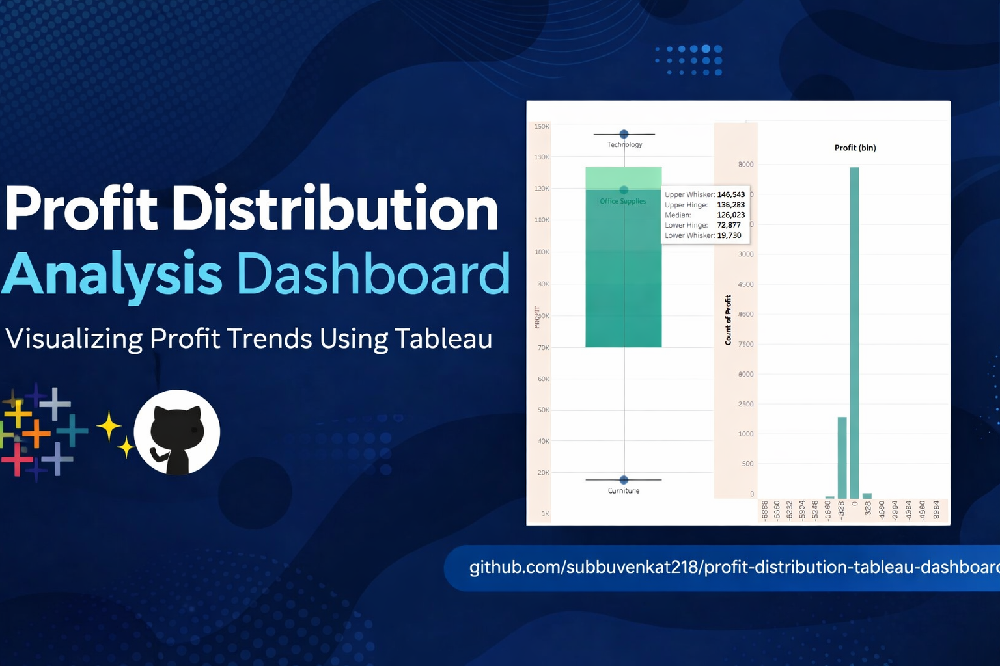

# 📊 Profit Distribution Analysis Dashboard (Tableau)

## 🔍 Overview

This project presents a **Profit Distribution Analysis Dashboard** built using Tableau Public.
The goal is to analyze how profit is distributed across different product categories using visual analytics.

## 📁 Dataset

* Sample Superstore Dataset
* Focused Feature: **Profit**

## 📊 Key Visualizations

* **Box Plot**

  * Shows distribution of profit across categories
  * Helps identify median, quartiles, and outliers

* **Histogram of Profit**

  * Displays frequency distribution of profit values
  * Helps understand profit spread and concentration

## 🎯 Insights

* Technology category shows higher profit consistency
* Furniture has wider variation and lower profit range
* Profit distribution is skewed, with most values concentrated in specific ranges

## 🛠️ Tools Used

* Tableau Public
* Data Visualization Techniques

## 🚀 Project Type

* Non-coding project
* Focused on **data visualization & analytics**

## 🔗 Tableau Dashboard

👉 https://public.tableau.com/app/profile/subbulakshmi.venkatesan/viz/ProfitDistributionAnalysisDashboard/Dashboard1

## 📌 Conclusion

This dashboard helps in understanding profit behavior across categories and supports better business decision-making using visual insights.
